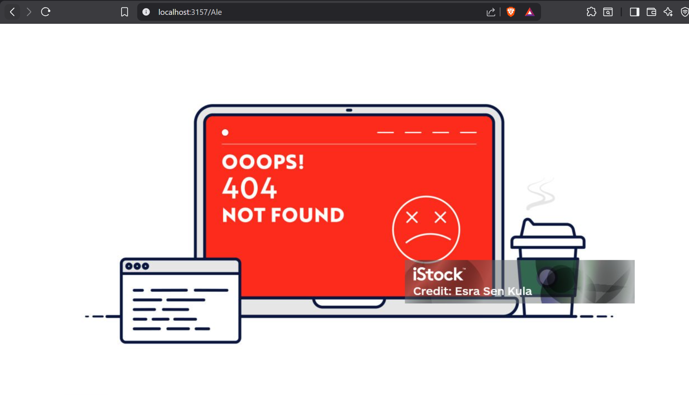
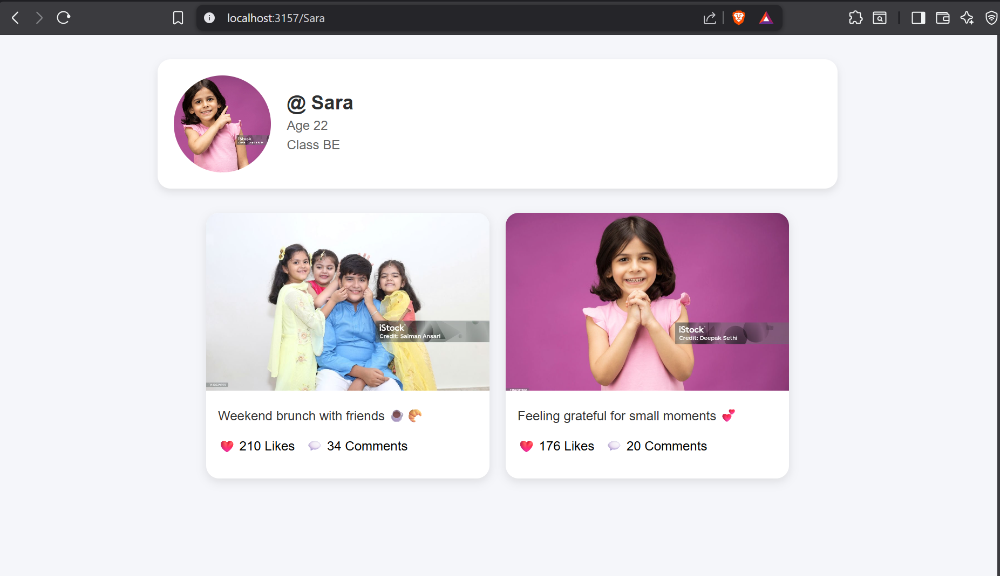
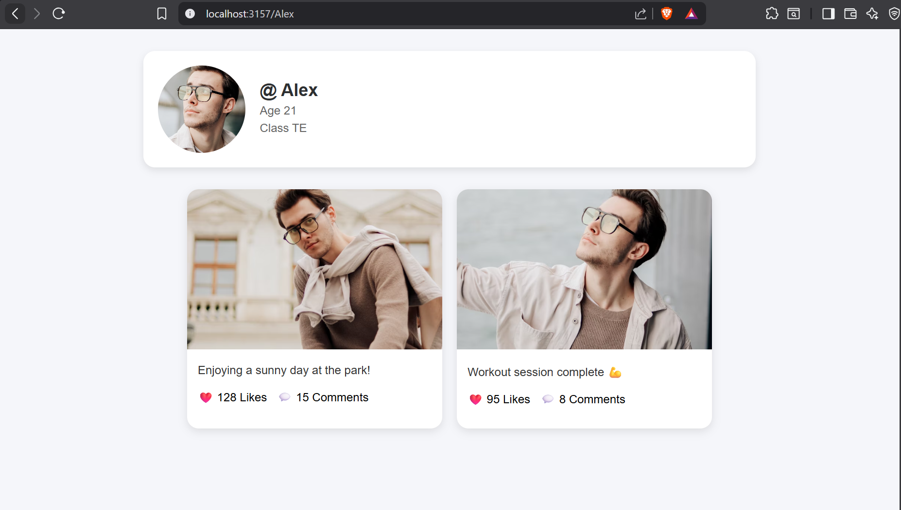

# WebPage (Flask)

A small Flask demo that serves simple profile pages from `data.json`.

## What this does

- Starts a Flask server that reads `data.json` and renders a profile page at `/<name>` (e.g. `/Alex`).
- If a requested name isn't found, it serves an error page.
- Port used by the app: 3157 (see `app.py`).

## Requirements

The project depends on Flask. There's a `requirements.txt` at the parent `Flask/` folder with:

```
flask
```

Install it with pip (example PowerShell commands below).

## How to run (PowerShell)

Open PowerShell in `Flask/WebPage` and run:

```powershell
# create and activate a virtual env (optional but recommended)
python -m venv venv
.\venv\Scripts\activate

# install requirements 
pip install -r .\requirements.txt

# start the server
python app.py
```

The server will start on http://127.0.0.1:3157. Example profile pages:

- http://127.0.0.1:3157/Alex
- http://127.0.0.1:3157/Sara
- http://127.0.0.1:3157/Vyom

If you request a name not present in `data.json` you'll see the error page (and `404Error.png` is an example output image included).

## Output images

The `output/` folder contains example screenshots/images produced during development. They are embedded below.

### 404 / error example



### Example screenshots





## Files of interest

- `app.py` — main Flask application (serves `/<name>` routes).
- `data.json` — sample profile data (contains `Alex`, `Sara`, `Vyom`).
- `templates/index.html` and `templates/error.html` — page templates.

## Notes and troubleshooting

- If the server does not start, confirm you used the correct Python executable and that Flask is installed in the active environment.
---
## Refereces
### YT-Channel(Raunak Jhoshi)
- https://youtube.com/playlist?list=PLT_6xP6jAq8j_m9OWFWlx1snf5uco6_m5&si=kRg-PCYM4jRg_-fR
---
### Jinja Template
- https://jinja.palletsprojects.com/en/stable/templates/
---
### flask
- https://flask.palletsprojects.com/en/stable/quickstart/#a-minimal-application
